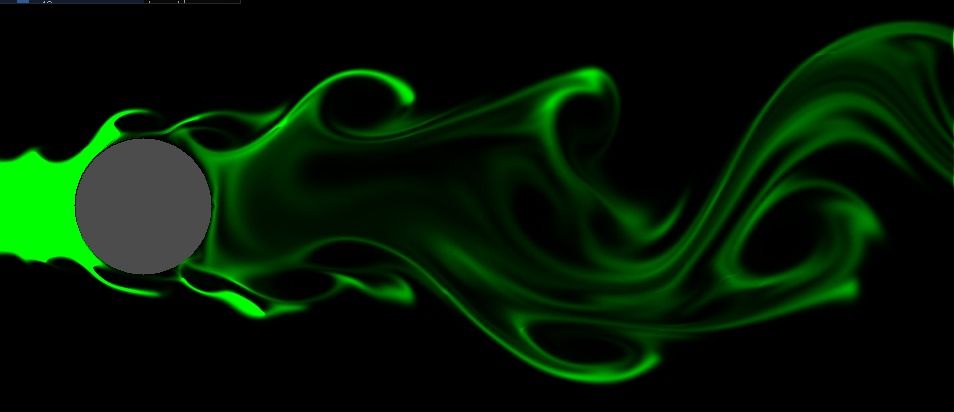
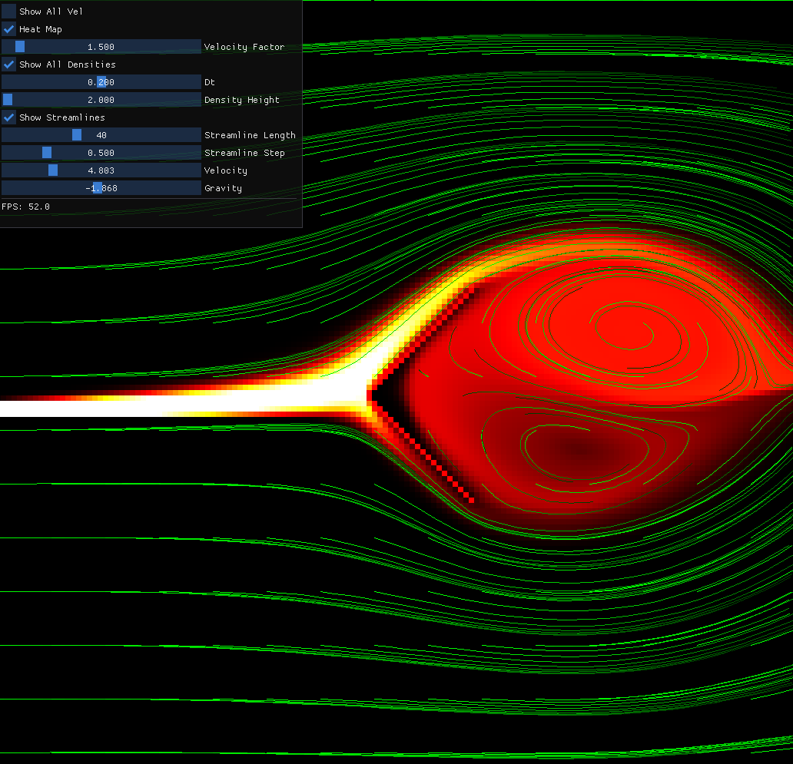

# Mass-Conserving Eulerian Fluid Simulator

**Wind tunnel simulation of flow around a cylinder (1024×1024 grid)**


---

## Overview

This project implements a **2D incompressible, mass-conserving Eulerian fluid
simulator** using a **MAC (Marker-and-Cell) grid**. The simulator emphasizes
**numerical fidelity** and **performance portability**, combining stable
advection schemes, pressure projection, and GPU/CPU parallelization.  

Key features include:  
- **Mass-conserving Semi-Lagrangian advection** for scalar transport and volume
fractions  
- **Pressure projection** via iterative solvers to enforce incompressibility  
- **Volume-of-Fluid (VOF) advection** with overflow redistribution for
boundedness  
- **GPU/CPU parallelization** using [Kokkos](https://github.com/kokkos/kokkos)  
- **Real-time visualization** with OpenGL and interactive control via ImGui  

---

## Tools & Frameworks

- **C++ / Kokkos** – parallelized simulation kernels  
- **OpenGL** – real-time rendering of the fluid fields  
- **ImGui** – interactive interface for live parameter tuning  
- **CMake** – build configuration  

---

## Installation

Clone the repository:  

```bash
git clone git@github.com:tim-pearson/EulerianFluidSim.git
cd EulerianFluidSim
```
Clone ImGui (if not already available):
```bash
git clone https://github.com/ocornut/imgui.git src/imgui

```
Build with CMake:
```bash
mkdir build
cd build
cmake ..
make -j$(nproc)

```
Run the simulation:
```bash
./sim
```

## Core Features

- MAC grid discretization with staggered velocity, pressure, and volume
fraction fields
- Semi-Lagrangian advection for stable transport of scalars and fluids
- Pressure solver (Jacobi iteration) with gradient subtraction for
divergence-free velocity fields
- VOF advection with clamping and redistribution to ensure conservation
- Parallelized compute kernels for advection, projection, and pressure solves
with Kokkos
- Interactive visualization for debugging and analysis in real time


## Perfomance

- Achieves ~14 ms/frame at 1024×1024 resolution (70+ FPS)
- Designed for numerical stability and mass conservation at high resolutions

**Wind tunnel simulation Cylinder**

**Wind tunnel simulation SDL prototype**
